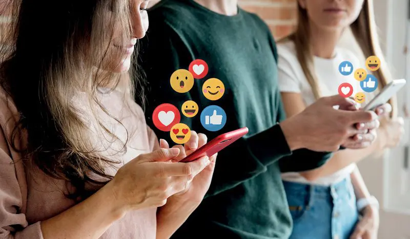

# Osasun-mentala-eta-sare-sozialak-2.-Ariketa- 
<!DOCTYPE html>
<html lang="eu">
<head>
    <meta charset="UTF-8">
    <title>Sarrera</title>
    
</head>
<body>
    <body style="background-color: rgb(204, 220, 224);"></body>
    <h1>Osasun mentala eta sare sozialak</h1>
    <nav>
        <a href="lehena.html">Lehena</a>
        <a href="bigarrena.html">Bigarrena</a>
        <a href="hirugarrena.html">Hirugarrena</a>
    </nav>
    
Azken urteotan, sare sozialak gure eguneroko bizitzaren parte bihurtu dira. Instagram, TikTok, X (lehen Twitter) edo Snapchat bezalako plataformek gure komunikatzeko, informatzeko eta adierazteko modua aldatu dute. Sare horien bidez munduko edozein lekutatik konektatzea posible da, baina aldi berean, horrek ekarri ditu zenbait erronka berriak, batez ere osasun mentalarekin lotuak.

<b>Osasun mentala</b> pertsonaren ongizate emozionala, psikologikoa eta soziala da; nola pentsatzen, sentitzen eta jokatzen dugun baldintzatzen du. <b>Sare sozialen</b> erabilera masiboak eragina izan dezake dimentsio horietan: batzuetan ongizatea indartu dezake, eta beste batzuetan, kalte egin.

</body>
</html>
